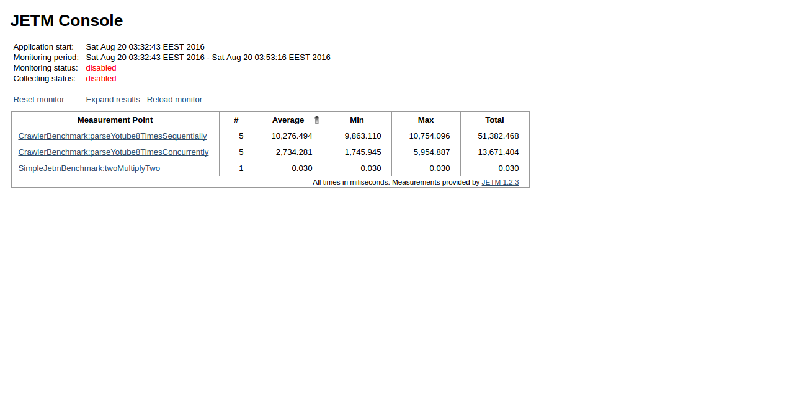

# ConcurrencyCookBook

  

### Overview
The collection of  concurrency programming examples with [JETM](http://jetm.void.fm/) benchmarks and detail explanations. Mostly in Java.

### How to run
    mvn clean install
    java -jar ./target/benchmarks.jar 
  
  Results will be available on [http://localhost:45000](http://localhost:45000)
  
  
### Problems 
  * jacoco doesn't work properly.
  * need an external tool to build charts.
  
    