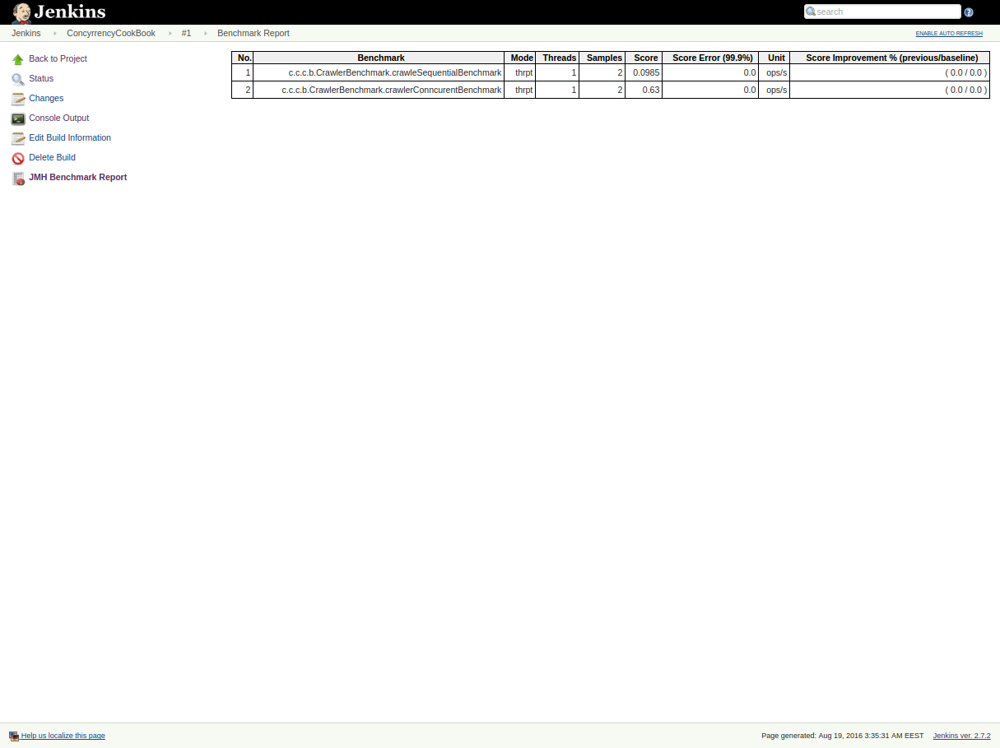

# ConcurrencyCookBook

  

### Overview
The collection of  concurrency programming examples with JMH benchmarks and detail explanations. Mostly in Java.

### How to build and run
    mvn clean install
    java -jar ./target/benchmarks.jar -rf=csv //output to a csv
    java -jar ./target/benchmarks.jar -rf=json //output to a json

### Issues

 * No official documentation ! Most useful are [official samples](http://hg.openjdk.java.net/code-tools/jmh/file/tip/jmh-samples/src/main/java/org/openjdk/jmh/samples/)
 * No official visualization and plot building tools [http://stackoverflow.com/questions/22040740/graphics-archiving/22046204#22046204](http://stackoverflow.com/questions/22040740/graphics-archiving/22046204#22046204)
 * Require deep knowledge of JVM internals to write proper benchmarks. 
 * Jacoco doesn't work properly.
      
      
### Workarounds
 * Plugin for Jenkins can build tables with benchmarks results and some charts.[https://github.com/artyushov/idea-jmh-plugin](https://github.com/artyushov/idea-jmh-plugin)  
 "File System SCM" plugin let to build from local directories.
 
 
### Development
 * Plugin for Intellij Idea simplify development [https://github.com/artyushov/idea-jmh-plugin](https://github.com/artyushov/idea-jmh-plugin)
 * Decrease number of "warmups" and "iterations" via appropriate annotations, if need execute benchmarks faster
  